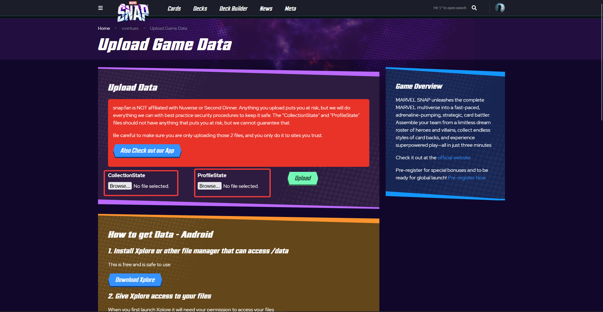
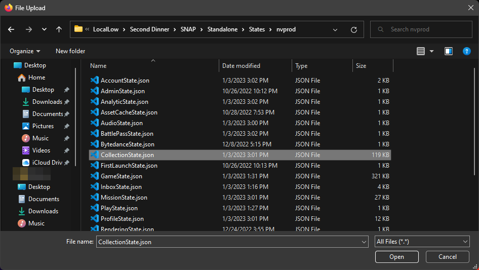
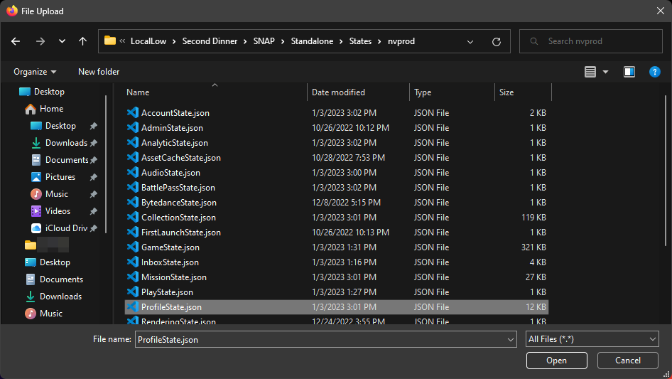
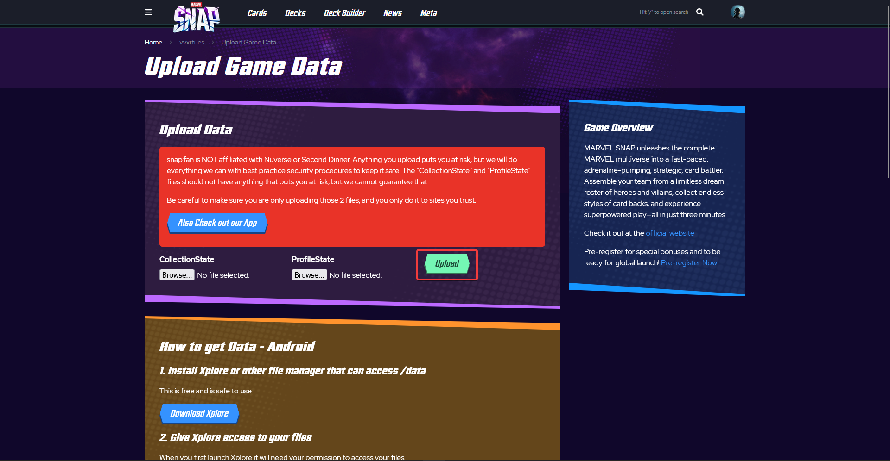

# Upload MARVEL SNAP data to [snap.fan](https://snap.fan) from Steam

## 1. go to the [Upload Game Data](https://snap.fan/u/upload-data/), or click on the profile icon then select the same option as well



## 2. Click on the `Browse...` button. When asked for file, set the address bar to the following: (replace `<username>` with your actual name)

```md
C:\Users\<username>\AppData\LocalLow\Second Dinner\SNAP\Standalone\States\nvprod\
```

 

## 3. Double click the respective file to select, then click `Upload`


